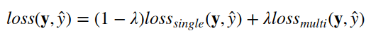
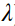
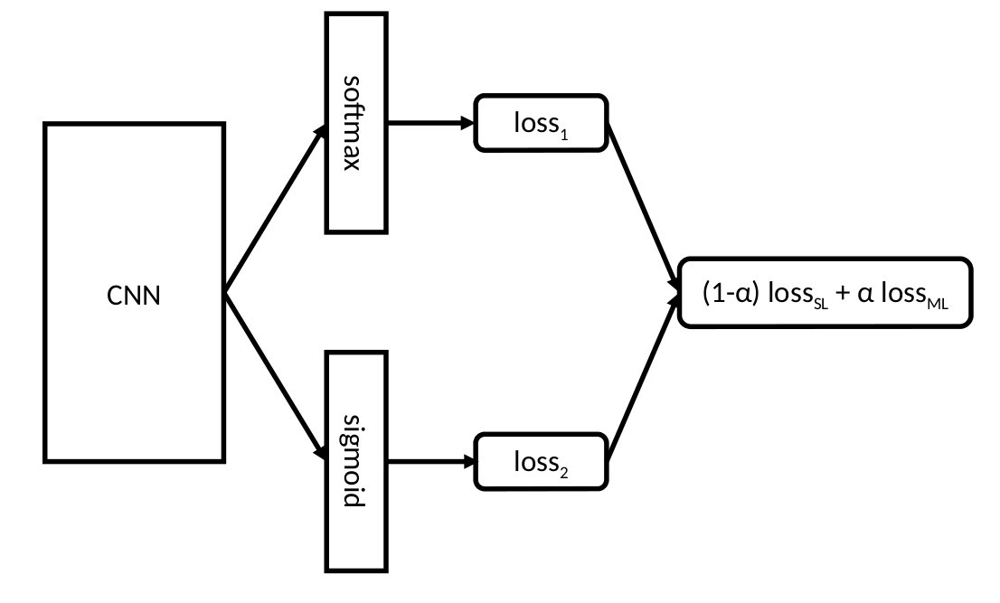

# Object Counting in Amazon Bin Images Dataset
## Contributors
Mustafa Ozan Tezcan

Professor Janusz Konrad
##Dependincies
The code was written with Python 3.6. The libraies we used are 

[PyTorch](http://pytorch.org/)

[Numpy](http://www.numpy.org/)

[TensorBoard](https://www.tensorflow.org/get_started/summaries_and_tensorboard)

## Description
This project is focused on object counting challenge which stated
[here](https://github.com/silverbottlep/abid_challenge).
The problem can be defined as counting the number of objects in a given image. 
We used the Amazon Bin Image Dataset (ABID) which
contains images and metadata from bins located in Amazon Fulfillment Center.
Details can be found
[here](https://aws.amazon.com/ko/public-datasets/amazon-bin-images/).
There are approximately 500.000 images in the dataset with varying number of objects.
For the counting problem, there are two different difficulties; the moderate task which aims 
to classify the bins with at most 5 objects, and the hard task which aims to predict the 
number of objects in any given bin image. Right now, our project is limited to the 
moderate task, but we are planning to extend our work for the hard task as well.

## Approach
In this project we used a transfer learning based method for counting problem. In the website
of ABID challange, authors are fine tuning the pre-trained ResNet34 for the counting problem 
and achieved 55.67% validation accuracy and 0.93 RMSE scores. ResNet architecture
uses a cross-entropy loss function with logits which is designed for multi-class but 
single-label classification. This is a well appropriate loss function for CCR metric,
however it is not a very good one for the RMSE metric since it lacks the ordering knowledge from
no object to 5 objects. For example for a 2-object bin it is equally likely to classify it 
as a 1-object bin or a 5-object bin. So we used another approach to decrease RMSE.
 
We wanted to give some sort of ordering information to the network. So, instead of a 
single-label, we used a multi-label approach. For an image with k objects, we also
included the labels for k-1 and k+1 objects, intuitively, this should give the
information about the distance between numbers to the network. For example the network
will see lots of examples with includes labels 1, 2, and 3 at the same time, however it won't
see any example which includes labels 1, 3, and 5 at the same time. With this labeling
we used Multi-label Soft Margin loss function from 
[torch.nn](http://pytorch.org/docs/master/nn.html). 

In contrast to the single-label, the multi-label approach is well suited for the RMSE metric, 
but it is not appropriate for the CCR metric. For performing well on both of the metrics, we 
decided to use a linear combination of single-label and multi-label loss functions.

Here  can be thought as a regularization parameter.
The overall architecture of the network is the following

## Running the Code

The main code can be found in 
[CNN_trials.ipynb](https://github.com/ozantezcan/Object-Counting-in-Amazon-Bin-Image-Dataset/blob/master/CNN_trials.ipynb)
notebook file. It uses the functions defined in 
[functions](https://github.com/ozantezcan/Object-Counting-in-Amazon-Bin-Image-Dataset/tree/master/functions) 
folder. For the instructions about how to run it, please follow the steps in the notebook file.

## Results
At first we used only 10.000 examples to do quick cross-validation and decide on the best set of 
parameters. As a result we achieved the best results with a stochastic gradient descent with decaying learning rate
which starts from 0.01 and drops by 1/10 after every 10 epochs and a momentum of 0.9.

Below plots shows the performance with different regularization coefficients.

